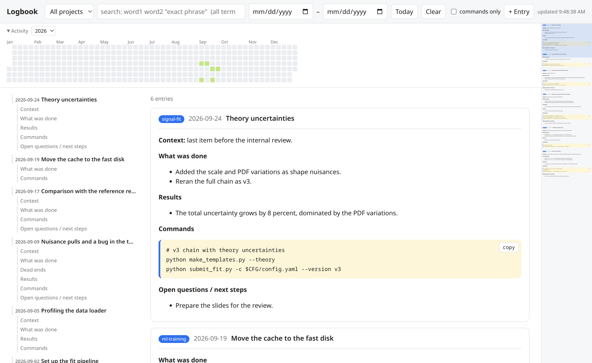

#  logbook-viewer

A development logbook is a running `LOGBOOK.md` in a repository: one dated entry per work session, written by Claude Code with the `logbook` skill. It records what was done, what changed, the decisions and the commands, so the project history stays readable months later.

This repository holds the two halves of that workflow:

| Part | Role |
|---|---|
| `skill/logbook/SKILL.md` | The Claude Code skill that **writes** entries. Defines the entry format. |
| `server.py`, `index.html` | A local web viewer that **reads** the logbooks of several projects. |

The skill and the viewer share one contract: the entry format below. Nothing else links them. The viewer only appends, never edits.



## Scope

In scope:
- Several projects, each with one `LOGBOOK.md`, listed in a config file.
- Browse by project, by day, or by period. A year heatmap shows on which days you worked.
- Full-text search over all projects or one project, with hit counts and snippets.
- Commands shown as separate blocks with a copy button, apart from the prose.
- Auto refresh: a new entry appears within 5 s, no reload.
- Add an entry by hand: the "+ Entry" button opens a form with the skill's template and appends to the chosen logbook.

Out of scope, by design:
- Editing past entries. The viewer only appends; the Markdown files are the source of truth. Edit them with a text editor.
- Accounts, a database, or a build step. The server is stateless and reads the files on every request.
- Remote access. The server binds `127.0.0.1` only. Use an SSH tunnel for a remote machine.

## Entry format (the contract)

````markdown
## 2026-09-20 — Short title of the session

**Context:** why this work was done.

**What was done**
- ...

**Commands**
```bash
# one comment line per step, then the command exactly as it was run
python submit_job.py -c $CFG/config.yaml -s fnf --version v1
```

**Open questions / next steps**
- ...
````

Rules the viewer depends on:
- An entry starts with `## YYYY-MM-DD — title` on one line. Everything up to the next such line is the entry body.
- Fenced ```` ```bash ```` blocks at top level are the commands. The viewer gives each one a copy button and the "commands only" mode shows only them.
- A top-level paragraph that starts in bold (`**Decisions**`, `**Context:** ...`) is a section. The table of contents lists them.
- Image paths are relative to the repository root. The viewer serves them from the logbook's directory.

The full rules for Claude are in the skill file.

## Install the skill

```bash
ln -s "$PWD/skill/logbook" ~/.claude/skills/logbook   # or cp -r
```

Then in a project: `/logbook` or "update the logbook".

## Run the viewer

```bash
python3 server.py            # uses ./config.json
python3 server.py my.json    # another config
```

`config.json`:

```json
{"port": 8765, "projects": [{"name": "unfolding-fnf", "path": "/path/to/LOGBOOK.md"}]}
```

Open http://localhost:8765/.

- Requirements: Python 3, a browser. Markdown rendering uses `marked` from a CDN; without network the page shows plain text.
- Top bar: project, search, period, Today, Clear, "commands only". Press `/` to focus the search.
- Search: all words must match; `"quoted phrase"` matches exactly. Results are closed cards with hit counts and snippet lines; open one for the full text.
- Activity strip: one cell per day, click it for the day view, `‹ ›` step one day. Click "Activity" to collapse the strip.
- Left column: the entries in view and their sections. Click to scroll.
- "+ Entry": project, date (today), title, body prefilled with the template. Ctrl+Enter appends. The page then shows that day.
- Filters live in the URL hash, so a reload or a bookmark keeps them.

## Run as a service (Linux, optional)

`desktop/logbook.service` is a systemd user unit. It starts the server at login and restarts it on failure. The desktop window then only connects to it.

```bash
sed "s|/home/USER/code/logbook-viewer|$PWD|g" desktop/logbook.service > ~/.config/systemd/user/logbook.service
systemctl --user daemon-reload
systemctl --user enable --now logbook.service
```

```bash
systemctl --user status logbook.service      # state
journalctl --user -u logbook.service -f      # log
systemctl --user restart logbook.service     # after a change to config.json or server.py
```

The server reads the files on every request, so a logbook on a network file system that needs a token (AFS, Kerberos) shows "cannot read" until the token exists, then recovers by itself. If it does not, restart the service.

## A desktop window (Linux, optional)

`desktop/logbook-app` opens the viewer in its own window: a small PySide6 script (`QWebEngineView`, F5 reloads), so the taskbar shows Logbook with its own icon instead of a browser. When nothing listens on the configured port it starts `server.py` itself, so the launcher is all you need. It uses the system `python3` with PySide6 (Fedora: `python3-pyside6`).

```bash
ln -s "$PWD/desktop/logbook-app" ~/.local/bin/logbook-app
cp desktop/logbook.svg ~/.local/share/icons/hicolor/scalable/apps/
sed "s|/home/USER|$HOME|g" desktop/logbook.desktop > ~/.local/share/applications/logbook.desktop
```

The launcher needs absolute paths: the desktop session's PATH does not contain `~/.local/bin`. The argument is a config path or an address, else `$LOGBOOK_URL`, else `config.json` next to `server.py`:

```bash
logbook-app                           # own server from ./config.json
logbook-app ~/my-logbooks.json        # own server from another config
logbook-app http://my-server:8765/    # only open an address
```

## Develop

- `python3 test_parse.py` checks the entry parser.
- `python3 server.py --parse LOGBOOK.md` dumps the parsed entries as JSON.
